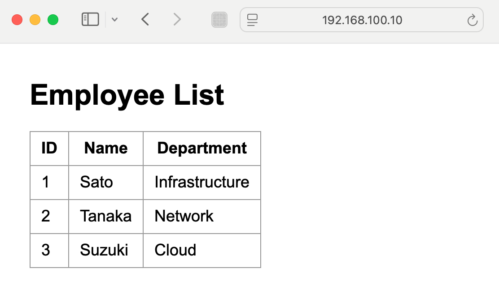
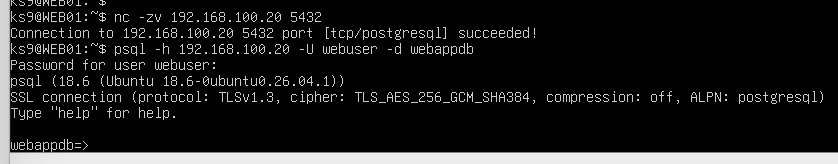
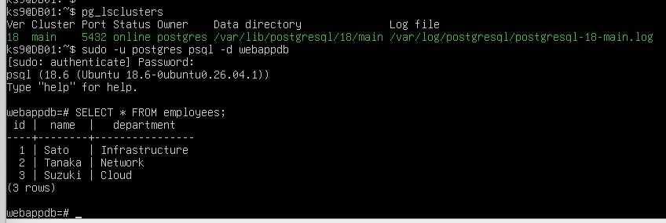

# Linux Web/DB Server Hands-on

Ubuntu Serverを使用して、WebサーバーとDBサーバーを分離したWeb/DB環境を構築したハンズオンです。

Apache / PHPを稼働させるWEB01と、PostgreSQLを稼働させるDB01を分離し、Webサーバーからデータベースへ接続してデータを取得・表示する構成を構築しました。

また、ApacheおよびPostgreSQLを意図的に停止し、サービス停止時の影響確認、ログ確認、復旧後の正常性確認まで実施しています。

## 構成

```text
Client
  |
  | HTTP / TCP 80
  v
WEB01
Ubuntu Server
Apache / PHP
192.168.100.10
  |
  | PostgreSQL / TCP 5432
  v
DB01
Ubuntu Server
PostgreSQL 18
192.168.100.20
```

## 使用技術

- Ubuntu Server
- Apache HTTP Server
- PHP
- php-pgsql
- PostgreSQL 18
- VirtualBox
- SSH
- Linux CLI
- systemd / systemctl
- journalctl
- nc
- psql
- curl

## 構築内容

### WEB01

- Ubuntu Serverの構築
- Apacheのインストール・起動
- PHP / php-pgsqlの導入
- DB01上のPostgreSQLへの接続
- PHPからデータベースのデータを取得
- 取得したデータをHTMLテーブルとして表示

### DB01

- Ubuntu Serverの構築
- PostgreSQL 18のインストール・起動
- `webappdb` データベース作成
- `webuser` DBユーザー作成
- `employees` テーブル作成
- テストデータ登録
- PostgreSQLのリモート接続設定
- `pg_hba.conf` による接続元制御
- `webuser`への参照権限設定

## 接続構成

| Source | Destination | Protocol / Port | Purpose |
|---|---|---|---|
| Client | WEB01 | HTTP / TCP 80 | Webアクセス |
| WEB01 | DB01 | PostgreSQL / TCP 5432 | DB接続 |
| Management PC | WEB01 / DB01 | SSH / TCP 22 | サーバー管理 |

## 動作確認

以下のコマンドを使用して、サービス稼働、サーバー間通信、データベース接続、およびWeb / DB連携を確認しました。

### WEB01 → DB01 ポート疎通

```bash
nc -zv 192.168.100.20 5432
```

### PostgreSQL接続

```bash
psql -h 192.168.100.20 -U webuser -d webappdb
```

### Web / DB連携確認

```bash
curl http://localhost/dbtest.php
```

WEB01からDB01へ接続し、PostgreSQLの`employees`テーブルから取得したデータをWebページとして表示できることを確認しました。

## 障害・復旧試験

通常時の疎通確認だけでなく、ApacheおよびPostgreSQLを意図的に停止し、障害発生時の影響と復旧を確認しました。

### Apache

以下の流れで試験を実施しました。

```text
Apache正常稼働
      ↓
Apache停止
      ↓
HTTPアクセス失敗
      ↓
journalctlでログ確認
      ↓
Apache起動
      ↓
Webページ正常表示
```

主な確認コマンド：

```bash
sudo systemctl stop apache2
systemctl status apache2
curl http://localhost/dbtest.php
sudo journalctl -u apache2 --since "10 minutes ago" --no-pager
sudo systemctl start apache2
```

### PostgreSQL

以下の流れで試験を実施しました。

```text
PostgreSQL正常稼働
        ↓
PostgreSQL停止
        ↓
TCP/5432接続失敗
        ↓
PHPからDB接続失敗
        ↓
journalctlでログ確認
        ↓
PostgreSQL起動
        ↓
TCP/5432接続復旧
        ↓
Web / DB連携復旧
```

主な確認コマンド：

```bash
sudo systemctl stop postgresql@18-main
systemctl status postgresql@18-main
nc -zv 192.168.100.20 5432
curl http://localhost/dbtest.php
sudo journalctl -u postgresql@18-main --since "10 minutes ago" --no-pager
sudo systemctl start postgresql@18-main
```

詳細な試験結果は [Test Results](docs/test-results.md) に記載しています。

## Screenshots

### Web / Database Integration

PHPからPostgreSQLの`employees`テーブルを参照し、Webページにデータを表示できることを確認しました。



### WEB01 → DB01 Connectivity

WEB01からDB01のPostgreSQL（TCP/5432）への疎通、および`psql`によるDB接続を確認しました。



### PostgreSQL Check

DB01上でPostgreSQLクラスタが稼働していること、および`employees`テーブルからデータを取得できることを確認しました。



## Documents

- [Build Procedure](docs/build-procedure.md)
- [Parameter Sheet](docs/parameter-sheet.md)
- [Test Results](docs/test-results.md)

## Configuration Examples

- [Apache Configuration](configs/apache/README.md)
- [Apache VirtualHost Example](configs/apache/000-default.conf.example)
- [PostgreSQL Configuration](configs/postgresql/postgresql.conf.example)
- [PostgreSQL Access Control](configs/postgresql/pg_hba.conf.example)

## Scripts

- [PHP Database Connection Sample](scripts/dbtest.php)

DB接続パスワードなどの認証情報はGitHub上には公開していません。

## Evidence

### Normal Operation

- [WEB01 Check](evidence/web01-check.txt)
- [DB01 Check](evidence/db01-check.txt)
- [Connectivity Check](evidence/connectivity-check.txt)

### Failure / Recovery Test

- [Apache Failure](evidence/apache-failure.png)
- [Apache Recovery](evidence/apache-recovery.png)
- [PostgreSQL Failure](evidence/postgresql-failure.png)
- [PostgreSQL Web Impact](evidence/postgresql-web-impact.png)
- [PostgreSQL Log / Recovery](evidence/postgresql-log-recovery.png)
- [PostgreSQL Web Recovery](evidence/postgresql-web-recovery.png)

## Repository Structure

```text
linux-web-db-hands-on/
├── README.md
├── .gitignore
├── configs/
│   ├── apache/
│   │   ├── 000-default.conf.example
│   │   └── README.md
│   └── postgresql/
│       ├── postgresql.conf.example
│       └── pg_hba.conf.example
├── docs/
│   ├── build-procedure.md
│   ├── parameter-sheet.md
│   └── test-results.md
├── evidence/
│   ├── web01-check.txt
│   ├── db01-check.txt
│   ├── connectivity-check.txt
│   ├── apache-failure.png
│   ├── apache-recovery.png
│   ├── postgresql-failure.png
│   ├── postgresql-log-recovery.png
│   ├── postgresql-web-impact.png
│   └── postgresql-web-recovery.png
├── images/
│   ├── web-page.png
│   ├── web01-db-connectivity.png
│   └── db01-postgresql-check.png
└── scripts/
    └── dbtest.php
```

## 学習・確認した内容

- Linuxサーバーの基本構築
- Apache / PHPによるWebサーバー構築
- PostgreSQLによるDBサーバー構築
- WebサーバーとDBサーバーの役割分離
- TCP/5432によるサーバー間通信
- PostgreSQLのリモート接続設定
- `pg_hba.conf` による接続元IP・DBユーザー制御
- DBユーザーへの必要な参照権限設定
- PHPからPostgreSQLへの接続
- SQLによるデータ取得
- Apache / PostgreSQLのサービス稼働確認
- `nc` / `psql` / `curl` を使用した疎通・動作確認
- Apache停止時のWebサービス影響確認
- PostgreSQL停止時のWebアプリケーション影響確認
- `journalctl`を使用したサービスログ確認
- サービス障害後の復旧および正常性確認
- 構築手順書、パラメータシート、試験結果、Evidenceの作成

## Notes

本リポジトリは、Linux / Web / Databaseの基本的な構築・設定・疎通確認、および障害・復旧確認を目的とした学習用ハンズオンです。

実環境で使用しているパスワードなどの認証情報は、サンプルファイルでは`CHANGE_ME`に置き換えています。