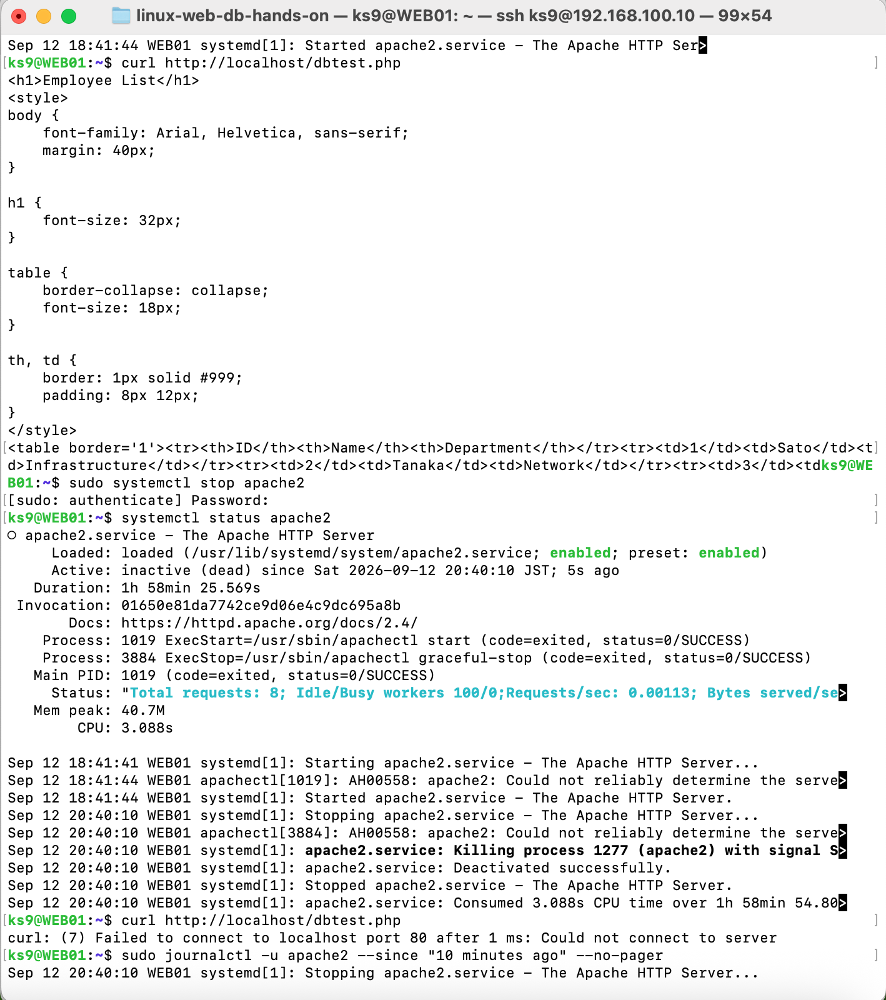
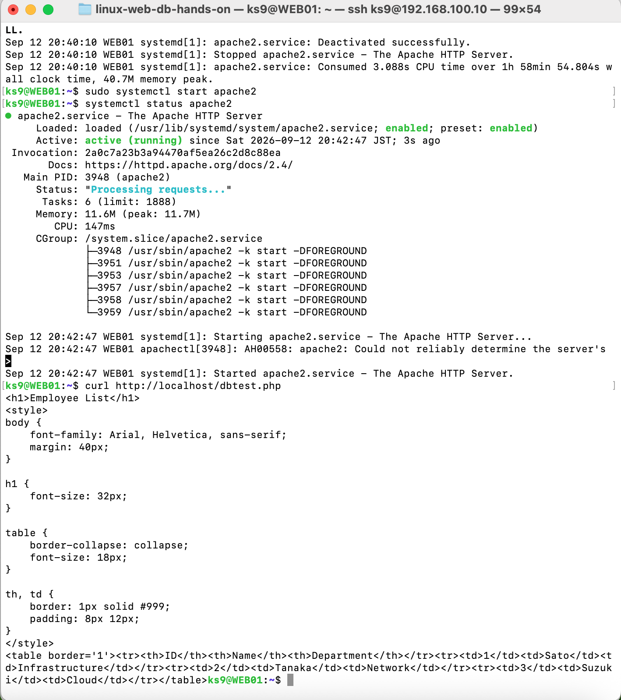
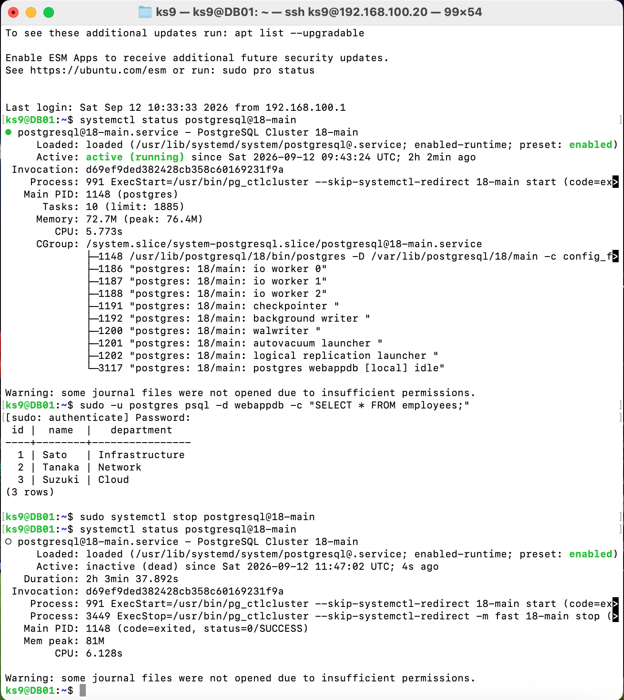
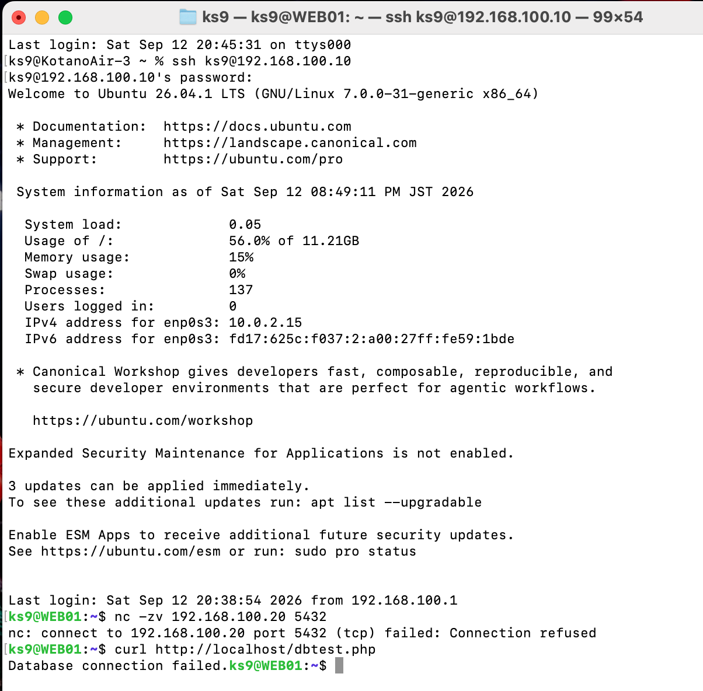
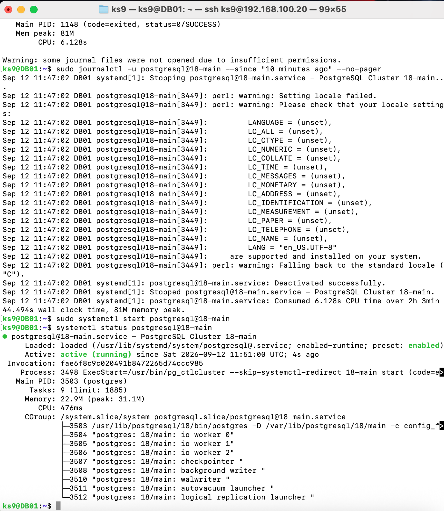
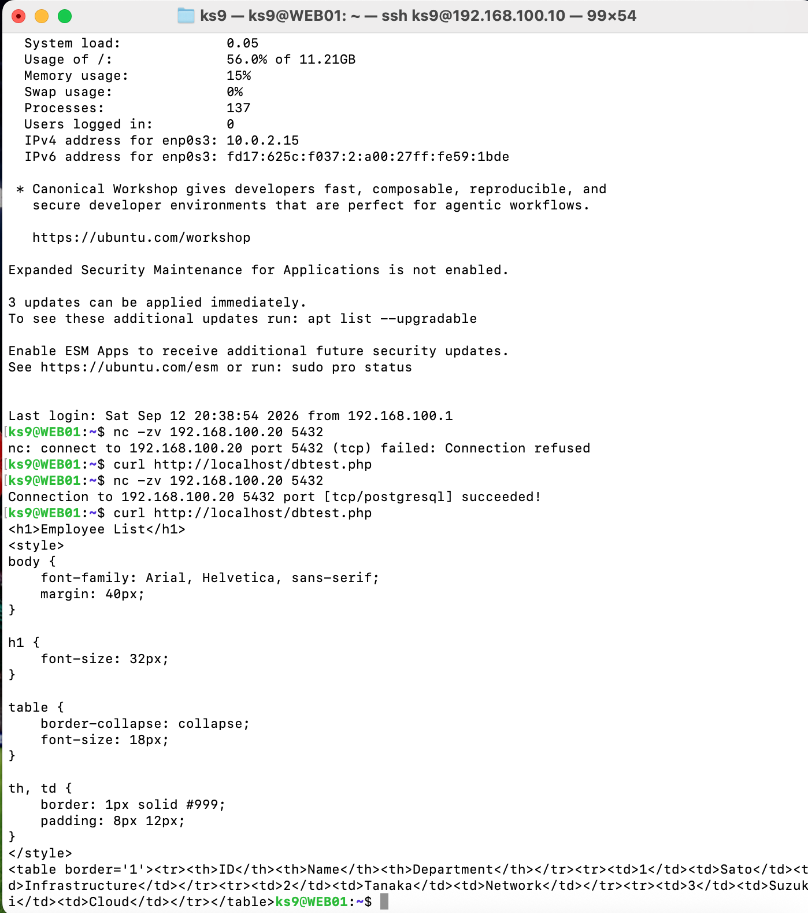

# 試験結果

## 1. 試験概要

WEB01 / DB01 の構築後、各サービスの稼働状態、サーバー間通信、PostgreSQL接続、WebアプリケーションからのDBデータ取得を確認しました。

また、ApacheおよびPostgreSQLを意図的に停止し、サービス停止時の影響確認、ログ確認、サービス復旧後の正常性確認を実施しました。

---

## 2. 正常系試験結果

| No. | 試験項目 | コマンド / 確認方法 | 期待結果 | 結果 |
|---|---|---|---|---|
| 1 | Apache稼働確認 | `systemctl status apache2` | `active (running)` | OK |
| 2 | PostgreSQL稼働確認 | `systemctl status postgresql@18-main` | `active (running)` | OK |
| 3 | WEB01 → DB01 ポート疎通 | `nc -zv 192.168.100.20 5432` | TCP/5432への接続成功 | OK |
| 4 | WEB01 → PostgreSQL接続 | `psql -h 192.168.100.20 -U webuser -d webappdb` | `webappdb`へ接続成功 | OK |
| 5 | テーブル確認 | `\dt` | `employees` が表示される | OK |
| 6 | employeesデータ確認 | `SELECT * FROM employees;` | 3件のテストデータが表示される | OK |
| 7 | Web動作確認 | `curl http://localhost/dbtest.php` | DBデータを含むHTMLが返却される | OK |

---

## 3. Apache稼働確認

WEB01で以下を実行しました。

```bash
systemctl status apache2
```

確認結果：

```text
Active: active (running)
```

Apacheが正常に稼働していることを確認しました。

---

## 4. PostgreSQL稼働確認

DB01で以下を実行しました。

```bash
systemctl status postgresql@18-main
```

確認結果：

```text
Active: active (running)
```

PostgreSQLクラスタが正常に稼働していることを確認しました。

---

## 5. WEB01 → DB01 通信試験

WEB01からDB01のPostgreSQLポートへの疎通を確認しました。

```bash
nc -zv 192.168.100.20 5432
```

TCP/5432への接続が成功することを確認しました。

---

## 6. PostgreSQL 接続試験

WEB01からDB01上のPostgreSQLへ接続しました。

```bash
psql -h 192.168.100.20 -U webuser -d webappdb
```

`webappdb` に正常に接続できることを確認しました。

---

## 7. データベース確認

### テーブル一覧

```sql
\dt
```

確認結果：

| スキーマ | テーブル | 所有者 |
|---|---|---|
| public | employees | postgres |

### employees

```sql
SELECT * FROM employees;
```

確認結果：

| id | name | department |
|---|---|---|
| 1 | Sato | Infrastructure |
| 2 | Tanaka | Network |
| 3 | Suzuki | Cloud |

---

## 8. WEB / DB連携試験

WEB01上で以下を実行しました。

```bash
curl http://localhost/dbtest.php
```

PostgreSQLの`employees`テーブルから取得したデータがHTMLとして返却されることを確認しました。

通信経路：

```text
クライアント
  |
  | HTTP
  v
WEB01
Apache / PHP
192.168.100.10
  |
  | TCP/5432
  v
DB01
PostgreSQL
192.168.100.20
```

これにより、Apache / PHPからPostgreSQLまでの一連の通信が正常に動作していることを確認しました。

---

## 9. Apache障害・復旧試験

WEB01上のApacheを意図的に停止し、Webサービスへの影響、ログ、および復旧後の動作を確認しました。

### 試験結果

| No. | 試験項目 | 期待結果 | 結果 |
|---|---|---|---|
| 1 | Apache停止 | `inactive (dead)`になる | OK |
| 2 | Webアクセス確認 | HTTP接続に失敗する | OK |
| 3 | Apacheログ確認 | サービス停止ログを確認できる | OK |
| 4 | Apache起動 | `active (running)`になる | OK |
| 5 | Web復旧確認 | `dbtest.php`が正常表示される | OK |

### 障害発生

```bash
sudo systemctl stop apache2
systemctl status apache2
```

確認結果：

```text
Active: inactive (dead)
```

Apache停止後、Webアクセスを確認しました。

```bash
curl http://localhost/dbtest.php
```

TCP/80への接続に失敗し、Webページへアクセスできないことを確認しました。

### ログ確認

```bash
sudo journalctl -u apache2 --since "10 minutes ago" --no-pager
```

Apacheサービスが停止されたことをログから確認しました。

### 復旧

```bash
sudo systemctl start apache2
systemctl status apache2
```

確認結果：

```text
Active: active (running)
```

Webアプリケーションを再確認しました。

```bash
curl http://localhost/dbtest.php
```

`Employee List`および`employees`テーブルのデータが再表示され、Webサービスが正常に復旧したことを確認しました。

### 確認証跡

#### Apache停止確認



#### Apache復旧確認



---

## 10. PostgreSQL障害・復旧試験

DB01上のPostgreSQLを意図的に停止し、WEB01からのDB接続およびWebアプリケーションへの影響、ログ、復旧後の動作を確認しました。

### 試験結果

| No. | 試験項目 | 期待結果 | 結果 |
|---|---|---|---|
| 1 | PostgreSQL正常確認 | `employees`テーブルを参照できる | OK |
| 2 | PostgreSQL停止 | `inactive (dead)`になる | OK |
| 3 | TCP/5432接続確認 | WEB01からの接続に失敗する | OK |
| 4 | PHP動作確認 | DB接続に失敗する | OK |
| 5 | PostgreSQLログ確認 | サービス停止ログを確認できる | OK |
| 6 | PostgreSQL起動 | `active (running)`になる | OK |
| 7 | TCP/5432復旧確認 | WEB01から接続できる | OK |
| 8 | Web/DB復旧確認 | `employees`のデータが再表示される | OK |

### 障害前正常確認

DB01でPostgreSQLが正常に稼働していることを確認しました。

```bash
systemctl status postgresql@18-main
```

続いて、`employees`テーブルのデータを確認しました。

```bash
sudo -u postgres psql -d webappdb -c "SELECT * FROM employees;"
```

3件のテストデータが正常に取得できることを確認しました。

### 障害発生

```bash
sudo systemctl stop postgresql@18-main
systemctl status postgresql@18-main
```

確認結果：

```text
Active: inactive (dead)
```

### WEB01からの影響確認

```bash
nc -zv 192.168.100.20 5432
```

確認結果：

```text
Connection refused
```

続いて、WEB01のWebアプリケーションを確認しました。

```bash
curl http://localhost/dbtest.php
```

確認結果：

```text
Database connection failed.
```

これにより、DBサービスの停止がWebアプリケーションに影響することを確認しました。

### ログ確認

```bash
sudo journalctl -u postgresql@18-main --since "10 minutes ago" --no-pager
```

PostgreSQLサービスの停止処理が実行されたことをログから確認しました。

### 復旧

```bash
sudo systemctl start postgresql@18-main
systemctl status postgresql@18-main
```

確認結果：

```text
Active: active (running)
```

WEB01からTCP/5432への接続を再確認しました。

```bash
nc -zv 192.168.100.20 5432
```

TCP/5432への接続が成功することを確認しました。

最後にWebアプリケーションを確認しました。

```bash
curl http://localhost/dbtest.php
```

`Employee List`および`employees`テーブルの3件のデータが再表示され、Web / DB連携が正常に復旧したことを確認しました。

### 確認証跡

#### PostgreSQL停止確認



#### WEBアプリケーション影響確認



#### PostgreSQLログ・復旧確認



#### WEB / DB復旧確認



---

## 11. 試験結果まとめ

正常系試験および障害・復旧試験を実施し、すべての試験項目で期待した結果を確認しました。

| 試験カテゴリ | 結果 |
|---|---|
| Apache稼働確認 | OK |
| PostgreSQL稼働確認 | OK |
| WEB01 → DB01通信 | OK |
| PostgreSQL接続 | OK |
| PHP → PostgreSQL連携 | OK |
| Web画面へのDBデータ表示 | OK |
| Apache障害検知 | OK |
| Apacheログ確認 | OK |
| Apache復旧 | OK |
| PostgreSQL障害検知 | OK |
| PostgreSQL停止時のWeb影響確認 | OK |
| PostgreSQLログ確認 | OK |
| PostgreSQL復旧 | OK |

今回の試験により、通常時のWeb / DB連携だけでなく、ApacheおよびPostgreSQLのサービス停止時に発生する影響を確認し、ログを用いた状態確認とサービス復旧後の正常性確認まで実施しました。